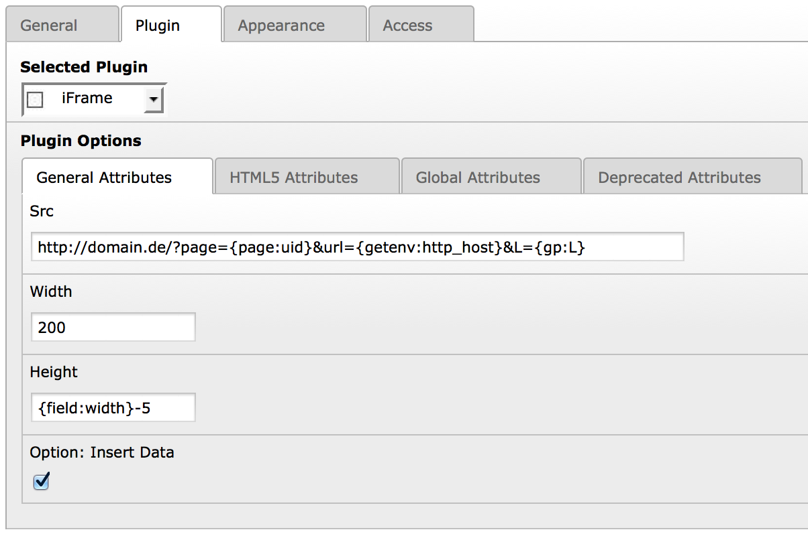
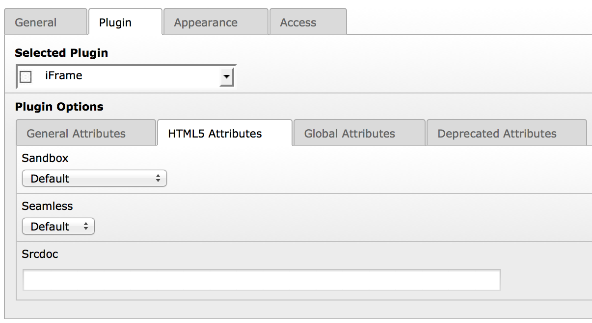
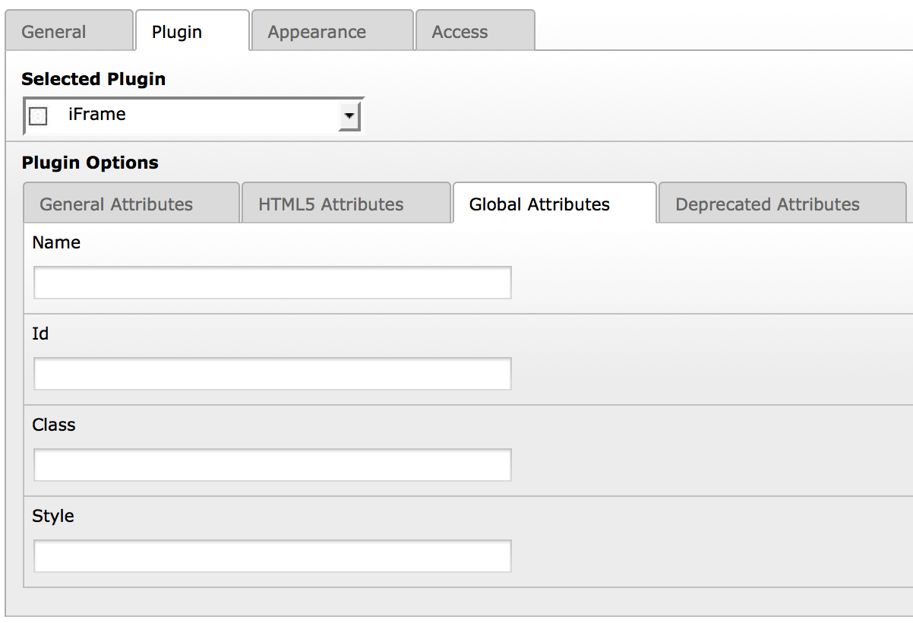
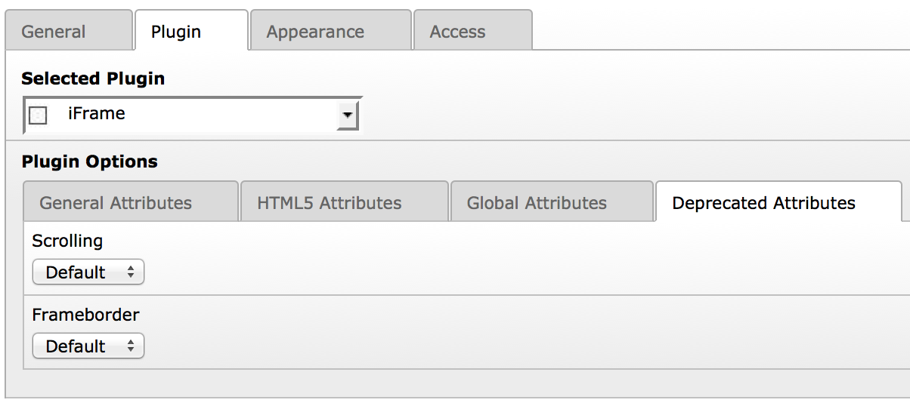
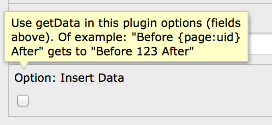

.. ==================================================
.. FOR YOUR INFORMATION
.. --------------------------------------------------
.. -*- coding: utf-8 -*- with BOM.

.. include:: ../Includes.txt

.. _screenshots:

===========
Screenshots
===========

	Attributes "Src", "Width" and "Height".
	"Option: Insert Data" enables "stdWrap.insertData" for every flexform field (See the example in "Src")

	Attributes "Sandbox", "Seamless" and "Srcdoc"

	Attributes "Id", "Name", "Class" and "Style"

	Attributes "Scrolling" and "Frameborders"

	Every field has a context help