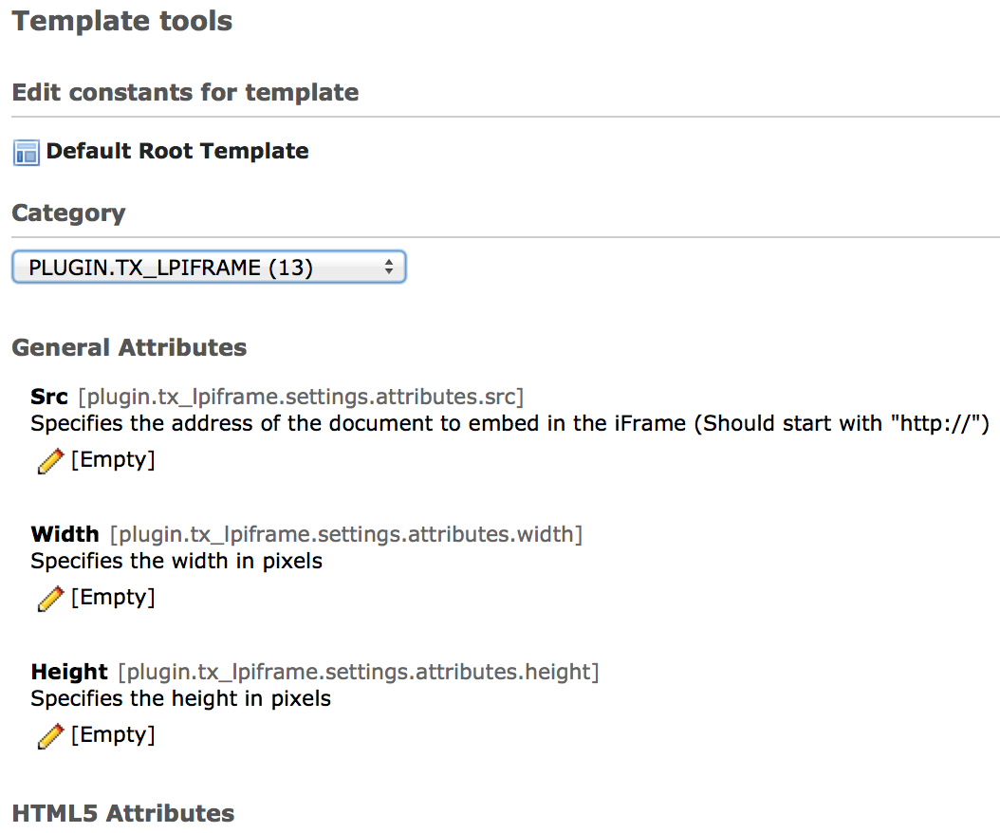

.. ==================================================
.. FOR YOUR INFORMATION
.. --------------------------------------------------
.. -*- coding: utf-8 -*- with BOM.

.. include:: ../Includes.txt

.. _typoscript:

==========
TypoScript
==========

CONSTANTS
=========

	All constants are present in the constants editor

SETUP
=========

The whole output is generated by TypoScript. You can find it by the TypoScript path "plugin.tx_lpiframe.renderObj".

All flexform values are available in the data-array. You can call them with "field = fieldName", "data = field:fieldName" or "{field:fieldName}" in TypoScript.

::

	plugin.tx_lpiframe {
		renderObj = COA
		renderObj {
			wrap = 
|

			10 = COA
			10 {
				wrap = <iframe|>

				# Src
				10 = TEXT
				10 {
					noTrimWrap = | src="|"|
					value = {$plugin.tx_lpiframe.settings.attributes.src}
					override.field = src
					required = 1
				}

				...

..